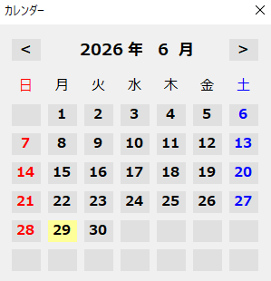
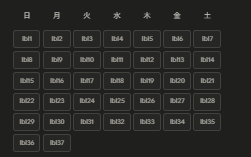
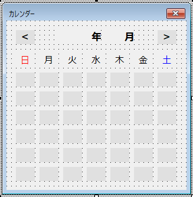

# VBA カレンダーフォームの作り方


- セルの日付列を選択すると、カレンダーがポップアップ表示される
- 日付をクリックするとセルに書き込まれ、カレンダーが閉じる
- 「＜」「＞」ボタンで月を移動できる
- 今日の日付が強調表示される


## 仕組み

カレンダーの本質は 

**「`lblDay1`〜`lblDay37` という37個のラベルを7列のグリッドに並べ、月によって中身（数字）だけ入れ替える」** という仕組み

なぜ37個かというと、月初が土曜の場合に最大6行必要で、7列×6行=42のうち実際に使う最大数が37になるため




---
## STEP 1 ユーザーフォームを作成



- フォームの名前を `frmCalendar` に変更（プロパティウィンドウの `(Name)` 欄）


---
## STEP 2 フォームにパーツを配置

ツールボックスから以下のパーツを配置します。

| パーツ種類 | Name プロパティ | Caption | 用途 |
|-----------|----------------|---------|------|
| Label | `lblYear` | （空欄） | 年の表示 |
| Label | `lblMonth` | （空欄） | 月の表示 |
| Label | `lblPreMonth` | ＜ | 前月ボタン |
| Label | `lblNextMonth` | ＞ | 翌月ボタン |
| Label × 37 | `lblDay1`〜`lblDay37` | （空欄） | 日付マス |
| Label × 7 | 任意 | 日〜土 | 曜日ヘッダー |

### 37個のラベルを効率よく配置する方法

1. ラベルを1個配置し、サイズを `幅: 28px, 高さ: 28px` に設定
2. そのラベルをコピーして7個横に並べる（1行目: `lblDay1`〜`lblDay7`）
3. 1行ごとコピーして計6行（`lblDay1`〜`lblDay42` でもよいが、37で十分）
4. 各ラベルの `Name` を `lblDay1`, `lblDay2`, ... と順番に変更

> 💡ˎˊ˗ ラベルは `BorderStyle = 1 (fmBorderStyleSingle)` にすると枠線が表示されてグリッドらしくなる


---
## STEP 3  定数を定義する

フォームのコード（`frmCalendar` をダブルクリック）の先頭に記述

```vba
Option Explicit

Private Const COLOR_NORMAL = &HE0E0E0   ' 通常の背景色（グレー）
Private Const COLOR_TODAY  = &H99FFFF   ' 今日の背景色（水色）

Public TargetRange As Range             ' 書き込み先のセル
```


---
## STEP 4  `SetCalendar` を実装する

月と年を受け取り、カレンダーを描画するプロシージャです。

```vba
Private Sub SetCalendar(ByVal yr As Integer, ByVal mo As Integer)

    ' 年・月ラベルを更新
    lblYear.Caption  = yr
    lblMonth.Caption = mo

    ' --- ① 全マスをリセット ---
    Dim i As Integer
    For i = 1 To 37
        Me.Controls("lblDay" & i).Caption  = ""
        Me.Controls("lblDay" & i).BackColor = COLOR_NORMAL
    Next i

    ' --- ② 1日の曜日からずらし量を計算 ---
    Dim firstDate As Date
    firstDate = DateSerial(yr, mo, 1)

    Dim position As Integer
    position = Weekday(firstDate) - 1
    '   日曜=0, 月曜=1, ..., 土曜=6
    '   Weekday() は日=1 を返すので -1 してずらし量に変換

    ' --- ③ 末日を求める ---
    Dim endDay As Integer
    endDay = Day(DateSerial(yr, mo + 1, 0))
    '   「翌月の0日目」= 今月の末日 という定番テクニック

    ' --- ④ 日付をラベルに書き込む ---
    For i = 1 To endDay
        Dim lbl As Object
        Set lbl = Me.Controls("lblDay" & (i + position))
        lbl.Caption = i

        ' 今日なら背景色を変える
        If DateSerial(yr, mo, i) = Date Then
            lbl.BackColor = COLOR_TODAY
        End If
    Next i

End Sub
```

### ずらし量の計算イメージ

```
例: 2024年1月 → 1日は「月曜日」
Weekday(2024/1/1) = 2  →  position = 2 - 1 = 1

lblDay1: 空欄    ← 1マスずらし
lblDay2: 1
lblDay3: 2
...
```


---
## STEP 5 `Initialize` を実装する

フォームを開く前に呼ぶ初期化処理。すでにセルに日付が入っていればその月を、空欄なら今月を表示。

```vba
Public Sub Initialize()

    Dim dt As Date

    If IsDate(TargetRange.Value) Then
        dt = TargetRange.Value   ' セルの日付をそのまま使う
    Else
        dt = Date                ' 空欄なら今日
    End If

    SetCalendar Year(dt), Month(dt)

End Sub
```


---
## STEP 6  月移動ボタンを実装する

```vba
Private Sub lblPreMonth_Click()
    Call MovePreMonth
End Sub

Private Sub lblPreMonth_DblClick(ByVal Cancel As MSForms.ReturnBoolean)
    Call MovePreMonth   ' ダブルクリックでも動作するよう両方設定
End Sub

Private Sub MovePreMonth()
    Dim dt As Date
    dt = DateSerial(lblYear.Caption, lblMonth.Caption - 1, 1)
    SetCalendar Year(dt), Month(dt)
End Sub

' ----

Private Sub lblNextMonth_Click()
    Call MoveNextMonth
End Sub

Private Sub lblNextMonth_DblClick(ByVal Cancel As MSForms.ReturnBoolean)
    Call MoveNextMonth
End Sub

Private Sub MoveNextMonth()
    Dim dt As Date
    dt = DateSerial(lblYear.Caption, lblMonth.Caption + 1, 1)
    SetCalendar Year(dt), Month(dt)
End Sub
```

> 💡ˎˊ˗ `DateSerial(yr, 0, 1)` のように月が0や13になっても、VBAは自動的に前月・翌月に繰り越してくれるので安全


---
## STEP 7  日付クリックを実装する

VBA のユーザーフォームはラベルのクリックイベントを動的にまとめられないため、37個分を個別に書く必要がある。

```vba
' --- 共通処理 ---
Private Sub OutputDate(ByVal dayStr As String)

    If dayStr = "" Then Exit Sub    ' 空マス（日付なし）は無視

    ' DateSerial で「日付オブジェクト」としてセルに書き込む
    ' 文字列で書くと Excelが日付として認識しないことがあるため重要
    TargetRange.Value = DateSerial(lblYear.Caption, lblMonth.Caption, dayStr)

    Me.Hide    ' 書き込んだらカレンダーを閉じる

End Sub

' --- 各ラベルのクリックイベント（37個） ---
Private Sub lblDay1_Click()  : Call OutputDate(lblDay1.Caption)  : End Sub
Private Sub lblDay2_Click()  : Call OutputDate(lblDay2.Caption)  : End Sub
Private Sub lblDay3_Click()  : Call OutputDate(lblDay3.Caption)  : End Sub
Private Sub lblDay4_Click()  : Call OutputDate(lblDay4.Caption)  : End Sub
Private Sub lblDay5_Click()  : Call OutputDate(lblDay5.Caption)  : End Sub
Private Sub lblDay6_Click()  : Call OutputDate(lblDay6.Caption)  : End Sub
Private Sub lblDay7_Click()  : Call OutputDate(lblDay7.Caption)  : End Sub
Private Sub lblDay8_Click()  : Call OutputDate(lblDay8.Caption)  : End Sub
Private Sub lblDay9_Click()  : Call OutputDate(lblDay9.Caption)  : End Sub
Private Sub lblDay10_Click() : Call OutputDate(lblDay10.Caption) : End Sub
Private Sub lblDay11_Click() : Call OutputDate(lblDay11.Caption) : End Sub
Private Sub lblDay12_Click() : Call OutputDate(lblDay12.Caption) : End Sub
Private Sub lblDay13_Click() : Call OutputDate(lblDay13.Caption) : End Sub
Private Sub lblDay14_Click() : Call OutputDate(lblDay14.Caption) : End Sub
Private Sub lblDay15_Click() : Call OutputDate(lblDay15.Caption) : End Sub
Private Sub lblDay16_Click() : Call OutputDate(lblDay16.Caption) : End Sub
Private Sub lblDay17_Click() : Call OutputDate(lblDay17.Caption) : End Sub
Private Sub lblDay18_Click() : Call OutputDate(lblDay18.Caption) : End Sub
Private Sub lblDay19_Click() : Call OutputDate(lblDay19.Caption) : End Sub
Private Sub lblDay20_Click() : Call OutputDate(lblDay20.Caption) : End Sub
Private Sub lblDay21_Click() : Call OutputDate(lblDay21.Caption) : End Sub
Private Sub lblDay22_Click() : Call OutputDate(lblDay22.Caption) : End Sub
Private Sub lblDay23_Click() : Call OutputDate(lblDay23.Caption) : End Sub
Private Sub lblDay24_Click() : Call OutputDate(lblDay24.Caption) : End Sub
Private Sub lblDay25_Click() : Call OutputDate(lblDay25.Caption) : End Sub
Private Sub lblDay26_Click() : Call OutputDate(lblDay26.Caption) : End Sub
Private Sub lblDay27_Click() : Call OutputDate(lblDay27.Caption) : End Sub
Private Sub lblDay28_Click() : Call OutputDate(lblDay28.Caption) : End Sub
Private Sub lblDay29_Click() : Call OutputDate(lblDay29.Caption) : End Sub
Private Sub lblDay30_Click() : Call OutputDate(lblDay30.Caption) : End Sub
Private Sub lblDay31_Click() : Call OutputDate(lblDay31.Caption) : End Sub
Private Sub lblDay32_Click() : Call OutputDate(lblDay32.Caption) : End Sub
Private Sub lblDay33_Click() : Call OutputDate(lblDay33.Caption) : End Sub
Private Sub lblDay34_Click() : Call OutputDate(lblDay34.Caption) : End Sub
Private Sub lblDay35_Click() : Call OutputDate(lblDay35.Caption) : End Sub
Private Sub lblDay36_Click() : Call OutputDate(lblDay36.Caption) : End Sub
Private Sub lblDay37_Click() : Call OutputDate(lblDay37.Caption) : End Sub
```


---
## STEP 8 シートから呼び出す（`Worksheet_SelectionChange`）

シートのコード（シートタブを右クリック→「コードの表示」）に記述

```vba
Private Sub Worksheet_SelectionChange(ByVal Target As Range)

    ' --- ガード条件①: 複数セル選択は無視 ---
    If Target.Count > 1 Then
        frmCalendar.Hide
        Exit Sub
    End If

    ' --- ガード条件②: 日付列（A列）以外は無視 ---
    If Target.Column <> 1 Then
        frmCalendar.Hide
        Exit Sub
    End If

    ' --- ガード条件③: ヘッダー行より前は無視 ---
    If Target.Row <= 3 Then
        frmCalendar.Hide
        Exit Sub
    End If

    ' --- ガード条件④: データ範囲より後は無視 ---
    ' （必要に応じて末行チェックを追加）

    ' カレンダーを表示
    Set frmCalendar.TargetRange = Target
    frmCalendar.Initialize
    frmCalendar.Show vbModeless   ' vbModeless = フォームを出しながらシートも操作可能

End Sub

Private Sub Worksheet_Deactivate()
    frmCalendar.Hide   ' シートを離れたら自動的に閉じる
End Sub
```

## 完成したコードの全体構成

```
frmCalendar（ユーザーフォーム）
├── 定数定義（COLOR_NORMAL, COLOR_TODAY）
├── Public TargetRange As Range
├── Initialize()          ← 外部から呼ぶ入口
├── SetCalendar(yr, mo)   ← カレンダーを描画する核心
├── MovePreMonth()        ← 前月に移動
├── MoveNextMonth()       ← 翌月に移動
├── OutputDate(dayStr)    ← セルに書き込んで閉じる
└── lblDay1_Click() 〜 lblDay37_Click()

wsKakeibo（シートモジュール）
├── Worksheet_SelectionChange()  ← カレンダーを起動するトリガー
└── Worksheet_Deactivate()       ← シート切替で自動クローズ
```


---
## VBA 関数のまとめ

| 関数 | 用途 | 例 |
|------|------|----|
| `DateSerial(yr, mo, dy)` | 年月日から日付を作る | `DateSerial(2024, 1, 1)` → 2024/01/01 |
| `DateSerial(yr, mo+1, 0)` | 月末日を求める | `DateSerial(2024, 2, 0)` → 2024/01/31 |
| `Weekday(date)` | 曜日番号を返す（日=1） | `Weekday(#2024/1/1#)` → 2（月） |
| `Day(date)` | 日の数値を返す | `Day(#2024/1/31#)` → 31 |
| `Year(date)` / `Month(date)` | 年・月を返す | `Year(Date)` → 今年 |
| `Date` | 今日の日付 | `Date` → 2024/06/29 |
| `IsDate(value)` | 日付かどうか判定 | `IsDate("2024/1/1")` → True |


---
## トラブルシューティング

- **カレンダーの日付がずれる**
→ `Weekday()` の第2引数で週の始まりを指定できます。`Weekday(date, vbSunday)` で日曜始まりに統一されます。

- **末日の翌日以降のマスに数字が入る**
→ `i + position` が37を超えるケースのガードが必要です。`If (i + position) <= 37 Then` で囲んでください。

- **セルに文字列として入ってしまう**
→ `TargetRange.Value = CDate(...)` や `DateSerial()` を使い、文字列ではなく日付型で書き込んでください。

- **フォームが最前面に出ない**
→ `frmCalendar.Show vbModeless` の前に `frmCalendar.ZOrder 0` を追加してみてください。
